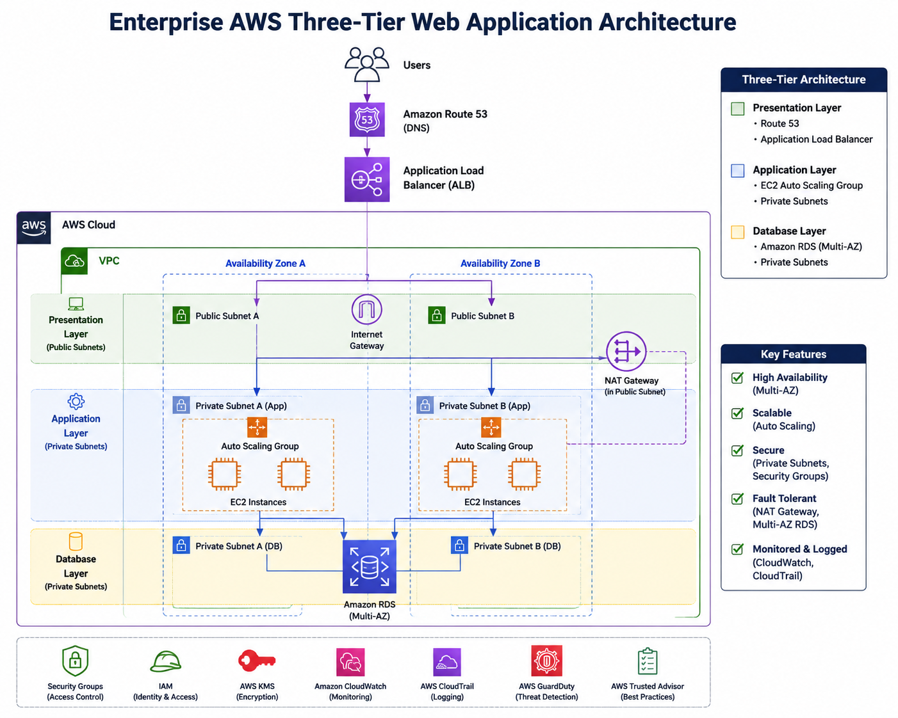

# Enterprise AWS Three-Tier Web Application Architecture

## 📌 Project Overview

This project demonstrates an enterprise-style three-tier web application architecture built on Amazon Web Services (AWS).

The architecture separates the application into three layers:

1. Presentation Layer
2. Application Layer
3. Database Layer

The design focuses on high availability, scalability, security, and fault tolerance.

## 🏗️ Architecture



```text
                    Internet
                       |
                 Amazon Route 53
                       |
                Application Load
                   Balancer
                       |
              -------------------
              |                 |
           EC2-A             EC2-B
        Web/App Server     Web/App Server
              |                 |
              ----------- -------
                       |
                  Amazon RDS
                    Database
